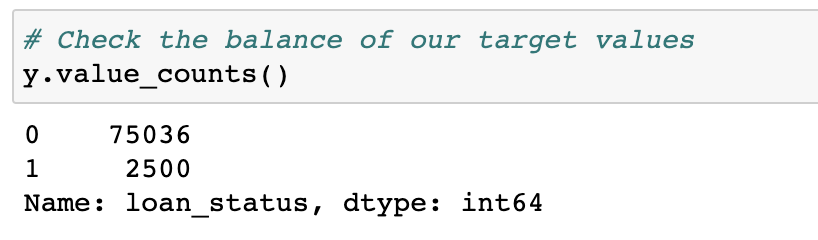
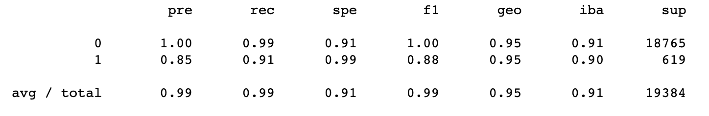
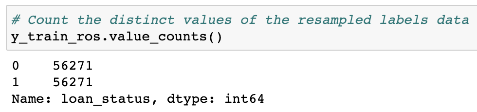
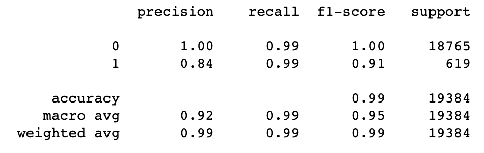

# Credit-Risk-Classification

Table of Contents
=================

  * [Background](#background)
  * [Objective](#objective)
  * [Credit Risk Analysis Report](#credit-risk-analysis-report)
  * [Method](#method)
  * [References](#references)
  
  
  
## Background
Use a dataset of historical lending activity from a peer-to-peer lending services company to build a model that can identify the creditworthiness of borrowers.

## Objective
  
  
Using knowledge of Python and supervised machine learning to train and evaluate the best model to use based on loan risk, where a healthy loan status is `0` and a high-risk loan status is `1`.

## Credit Risk Analysis Report

Please see the file `credit_risk_analysis_report.md` for full details regarding the description of the analysis for the machine learning models, bulleted lists describing balanced accuracy scores, prediction and recall of all machine learning models and a summary of the results of the machine learning models with a recommendation on which model to use. 

## Method

### Split the Data into Training and Testing Sets

1. Read the `lending_data.csv` data from Resources folder into a Pandas DataFrame.
2. Create labels set (y) from 'loan_status' column and create features (X) DataFrame from remaining columns.
3. Check balance of the labels variable (y) with value_counts function.
4. Split dataa into training and testing datasets by using train_test_split. 

  

### Create a Logistic Regression Model with the Original Data

1. Fit a logistic regression model using the training data (`X_train` and `y_train`).
2. Save predictions on testing data labels using the testing feature data (`X_test`) and the fitted model. 
3. Evaluate the mode's performance by completing the following:
        a. Calculate accuracy score of the model.
        b. Generate a confusion matrix.
        c. Print the classification report. 

   

**How well does the logistic regression model predict both the `0` (healthy loan) and `1` (high-risk loan) labels?** 

According to the balanced accuracy score of 95%, the model is performing well; however, this is likely due to an imbalanced dataset. When analyzing the dataset, the number of healthy loans (low-risk) highly outweigh the number of high-risk loans. This indicates that the model is better at predicting a loan status as healthy in comparison to a loan status as high-risk. As the dataset is imbalanced, we need to further look at the oversampled dataset. 

When analyzing both the balanced and imbalanced classification reports, the model is able to predict healthy loans `0` 100% of the time, with 99% of those recalled correctly. The model is only able to predict high-risk loans `1` with a precision of 85%, and of those 85% correctly identified there is a recall rate of 91%. 

Overall, precision and recall values are extremely improtant because the cost of misclassification can be high. A high precision score is important to minimize false positives, which can lead to a loss of potential customers. On the other hand, a high recall score is important to minimize false negatives, which can lead to significant financial losses.

### Predict a Logistic Regression Model with Resampled Training Data

1. Use the `RandomOverSampler` module from the imbalanced-learn library to resample the data. Confirm labels have an equal number of data points. 
  

2. Use the `LogisticRegression` classifier and resampled data to fit the model and make predictions.
3. Evaluate the model's perforamnce by completing the following:
        a. Calculate accuracy score of the model.
        b. Generate a confusion matrix.
        c. Print the classification report. 
        
         

**How well does the logistic regression model, fit with oversampled data, predict both the `0` (healthy loan) and `1` (high-risk loan) labels?**

Overall, in analyzing the results of the machine learning models, the oversampled model would be the model of choice. The oversampled model generated a balanced accuracy score of 99%, which is an improvement than the prior logistic regression model on original data of 95%. It continues to perform the same when being able to correctly identify health loans, as the precision is 100%, and the recall remains at 99%. More importantly, where the oversampled model performs better is with the recall rates for high-risk loans. Although still obtaining a similar precision as the logistic regression model on original data at 84% in comparison to 85%, of these 84% that are correctly identified at high-risk, there is a recall of 99%. This is an improvement from the 91% on the prior logistic regression model on original data. 

The oversampled model helps to better predict the true positives meaning that it is more effective at distinguishing high-risk loans with high recall accuracy. As well, as the number of false positives significantly decreases, the oversampled model is able to classify healthy and high-risk loans more correctly.

## References 

* Dataset provided by edX UofT Data Analytics, which had been generated by Trilogy Education Services, LLC. This is intended for educational purposes only.

- - -

